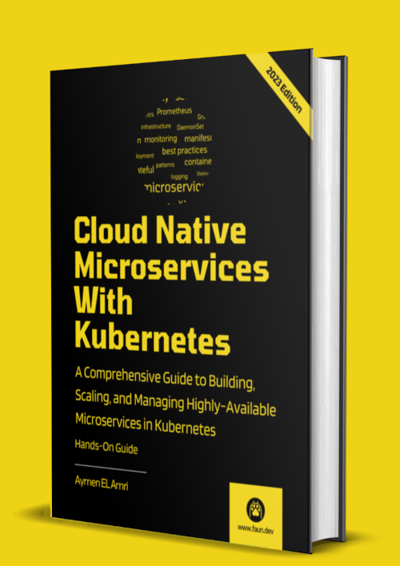

# ci-cd-with-argocd-helm-and-github-actions

This repository was used in [Cloud Native Microservices with Kubernetes Book](https://leanpub.com/cloud-native-microservices-with-kubernetes/).
It explains how to setup a full CI/CD using GitOps principles and tools like GitHub Actions, Helm, Helm Chart Releaser, Argo CD and more.

The created pipeline looks like this:

